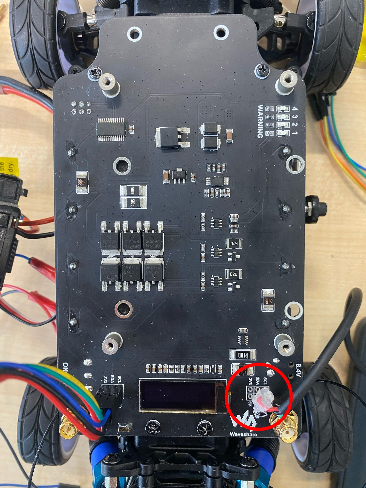
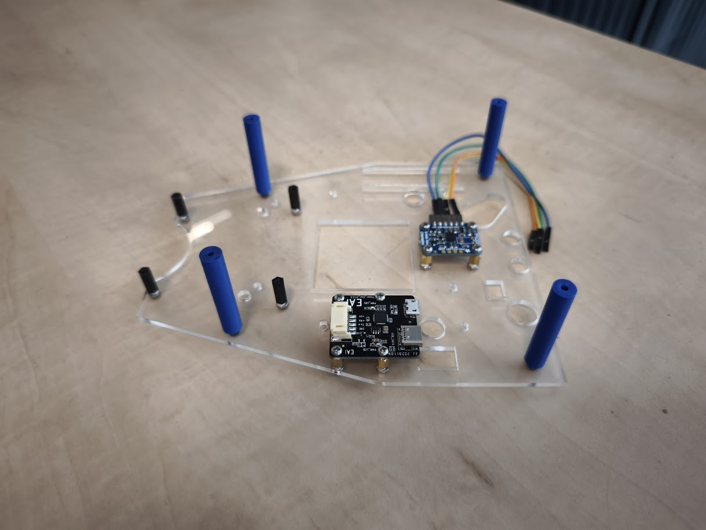
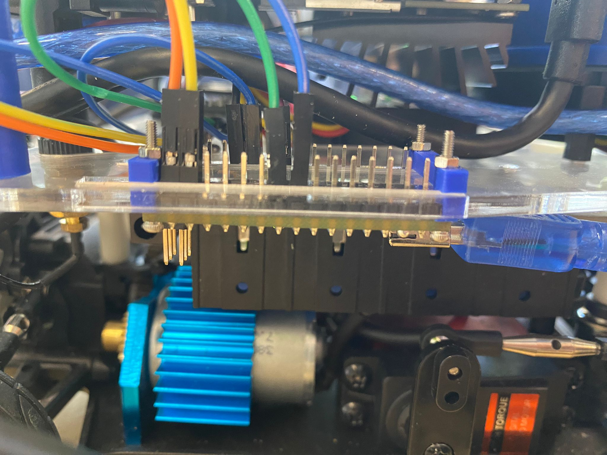
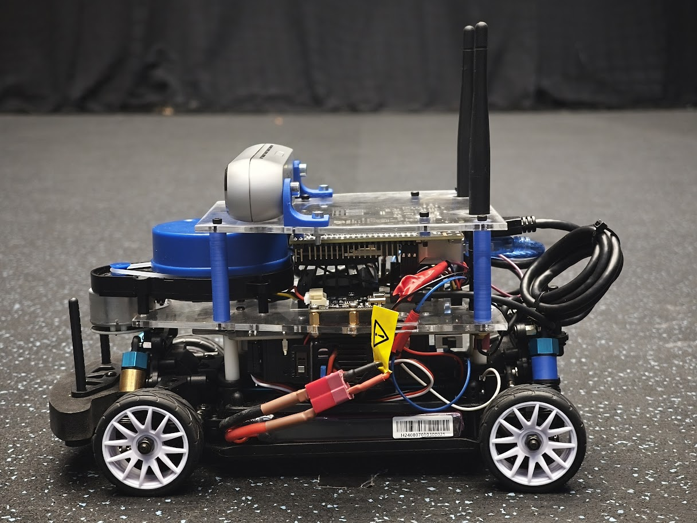

# Build Instructions
These build instructions assume you already have a DART, according to [Lorenzo Lyon's Github](https://github.com/Lorenzo-Lyons/DART) and want to upgrade it with a camera that's suitable for object detection applications. 

For all applications of DART, even if you don't want to upgrade the camera, it's best practice to follow the rest of the building instructions in this repository. Changing the LiDar's power supply will prevent the Jetson Nano from overheating. Changing the upperboard and baseboard with the 3D-printed standoffs will lower the center of mass as much as possible. The DART is a really fast robot and could tilt easily in a sharp corner. Especially now with a heavy camera on it. So lowering the center of mass is preferred. Additionally, the Arduino, IMU and USB Adapter Board for the LiDar can now be mounted to the baseboard.

At the bottom, you can find how we built our 3D-printed traffic light.

# Required Extra Components
+ a micro USB cable for the LiDar's power supply
+ The updated baseboard and upperboard [dxf files](https://github.com/Semthart28/DART-5/tree/main/Build%20Instructions/DXF%20files)
+ The Intel RealSense Depth Camera D455 [link](https://store.intelrealsense.com/buy-intel-realsense-depth-camera-d455.html)
+ The new 3D-printed parts [STL files](https://github.com/Semthart28/DART-5/tree/main/Build%20Instructions/STL%20files) (Carefully read how many times you need to print each file)
+ Some bolts and screws:
    + 12x M2.5 8mm Stainless Steel Screws
    + 16x M2.5 Stainless Steel Nuts
    + 8x M2.5 6mm-6mm brass female-male
    + 12x M2.5 ~14mm screws
    + 2x M4 ~8mm screws (Intel camera mounts)
    + 2x M3 ~10mm screws
    + 2x M3 nuts
    + 4x M1.6 ~10mm screws 
    + 4x M1.6 nuts
+ This small Arduino LED display for the traffic light [link](https://nl.aliexpress.com/item/1005006161998547.html?spm=a2g0o.order_list.order_list_main.5.454a79d2ccuUTg&gatewayAdapt=glo2nld)
# Changing the LiDar's power supply
In order to change the LiDar's power supply, you need to strip a micro-USB cable. Attach the micro-USB port to the USB adapter board of the LiDar and solder the the stripped end of the cable directly onto the Jetracer Pro Expansionboard as shown in the image below:

  

Solder the red cable of the micro-USB to the labeled '5V' and the black cable to the labeled 'GND' on the right-hand-side of the display. Now the LiDar is directly connected to the battery pack.

# Replacing the Baseboard
On the new baseboard, you can attach the IMU and the USB Adapterboard of the LiDar as shown in this image below (left):

  
  

On the right, you can see how to attach the Aduino Nano to the slots on the baseboard with the 3D printed pieces.

Attach the blue standoffs and the black standoffs that belong to the LiDar's setup and then attach the baseboard onto the expansionboard.

# Adding the new camera setup
A side-view of the DART is shown here below:

  

Attach the 3D-printed camera mounts to the back of the camera with M4 bolts and to the upperboard with M3 bolts. Plug the USB cable in the Jetson Nano and your camera setup is done!

# Replacing the Brass spacers of the suspension with 3D-printed spacers (Optional)
If you want to, you can replace the brass spacers of the suspension with the 3D printed 'Bus' STL file.  We did this so we didn't have to buy the brass rings and can print them easily with the other 3D parts.

# 3D-printed traffic light
For printing the white edge of the traffic light we took advantage of having access to a 3d printer with multiple color usage during prints. We made a separate 3d model for the white edge which we merged in the slicer software with the rest. By having two separate stl's we could easily assign them a different colour and print them as one. Not everyone has access to this kind of printer. In that case you could choose to print them separately in a different color and superglue them together or just print everything in black and use white paint! This would probably give simular results.

  

