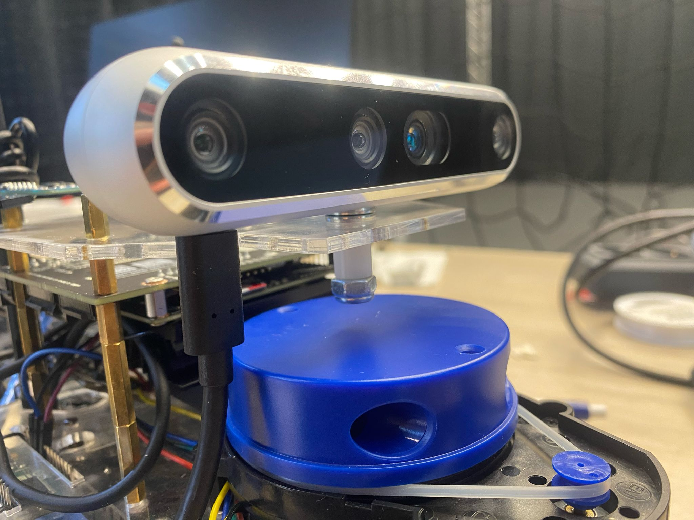

# Build Instructions
These build instructions assume you already have a DART, according to [Lorenzo Lyon's Github](https://github.com/Lorenzo-Lyons/DART) and want to upgrade it with a camera that's suitable for object detection applications. 

For all applications of DART, even if you don't want to upgrade the camera, it's best practice to follow the rest of the building instructions in this repository. Changing the LiDar's power supply will prevent the Jetson Nano from overheating. Changing the upperboard and baseboard with the 3D-printed standoffs will lower the center of mass as much as possible. The DART is a really fast robot and could tilt easily in a sharp corner. Especially now with a heavy camera on it. So lowering the center of mass is preferred. Additionally, the IMU and USB Adapter Board for the LiDar can now be mounted to the baseboard.

# Required Extra Components
+ a micro USB cable for the LiDar's power supply
+ The updated baseboard and upperboard [dxf files](https://github.com/Semthart28/DART-5/tree/main/Build%20Instructions/DXF%20files)
+ The Intel RealSense Depth Camera D455 [link](https://store.intelrealsense.com/buy-intel-realsense-depth-camera-d455.html)
+ The new 3D-printed parts [STL files](google.com) (Carefully read how many times you need to print each file)
+ Some bolts and screws:
    + 12x M2.5 8mm Stainless Steel Screws
    + 16x M2.5 Stainless Steel Nuts
    + 8x M2.5 6mm-6mm brass female-male
    + 12x M2.5 ~14mm screws
    + 2x M4 ~8mm screws (Intel camera mounts)
    + 2x M3 ~10mm screws
    + 2x M3 nuts
    + 4x M1.6 ~10mm screws 
    + 4x M1.6 nuts

# Changing the LiDar's power supply
In order to change the LiDar's power supply, you need to strip a micro-USB cable. Attach the micro-USB port to the USB adapter board of the LiDar and solder the the stripped end of the cable directly onto the Jetracer Pro Expansionboard as shown in the image below:

  

Solder the red cable of the micro-USB to the labeled '5V' and the black cable to the labeled 'GND' on the right-hand-side of the display. Now the LiDar is directly connected to the battery pack.

# Replacing the Baseboard
On the new baseboard, you can attach the IMU and the USB Adapterboard of the LiDar as shown in this image below:

  

Attach the blue standoffs and the black standoffs that belong to the LiDar's setup and then attach the baseboard onto the expansionboard.

# Adding the new camera setup
A close-up of the camera setup is shown here below:

  

You'll need to replace the upper board with the updated version to leave a gap for attaching the camera and enough space to plug in the cable. Plug the other end of the cable into a USB port on the Jetson Nano and your camera-setup is done!
