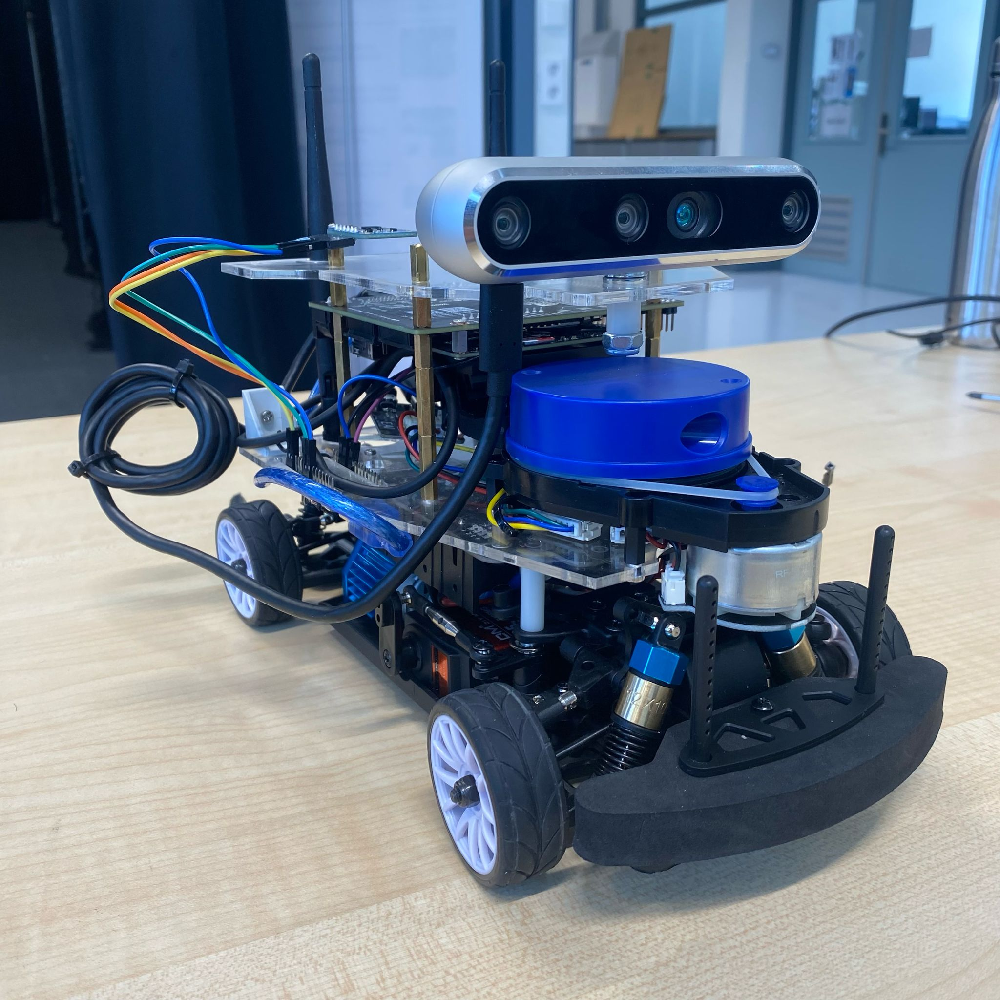

# Upgrading DART: Adding Traffic Light Detection

  

# This Repo
In this repository, we're upgrading the DART robot for traffic light detection. DART is a robot, created at the TU Delft and instructions for building your own DART can be found [here](https://github.com/Lorenzo-Lyons/DART). In this repository, you'll find:
+ <b>Build instructions</b> for physical changes we made.
+ <b>Software for Traffic Light Detection</b> in order that the DART recognises a traffic light and which light it's currently displaying.
+ <b>Control</b> a simple control alogrithm that lets the DART drive autonomously without crashing.

# Physical Changes We Made to DART + Building Instructions
The physical changes we made to the DART:
+ We changed the baseboard and upperboard to make the car less top-heavy and be able to install the new camera setup and LiDar power supply.
+ The LiDAR is connected directly to the Jetson Nano Expansion Board rather than to the Jetson Nano itself. This setup resolves the issue of the LiDAR drawing too much current from the Jetson Nano.
+ A new camera setup is added to enable the DART to perform traffic light detection.

To see the full Build Instructions for these changes, go to [Build Instruction Section](https://github.com/Semthart28/DART-5/tree/main/Build%20Instructions).

# Software for Traffic Light Detection

# Control Algorithm to autonomously drive the car through traffic lights
