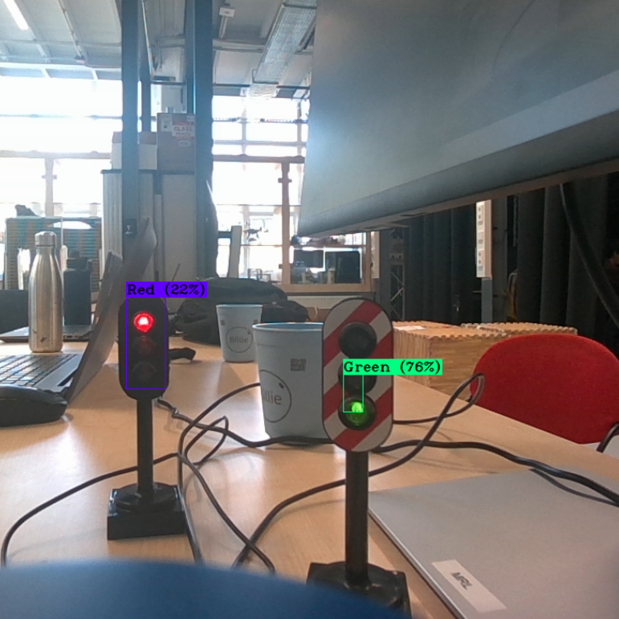

# Upgrading DART: Adding Traffic Light Detection

<p align="center">
  
</p>

# This Repo
In this repository, we're upgrading the DART robot for traffic light detection. DART is a robot, created at the TU Delft and instructions for building your own DART can be found [here](https://github.com/Lorenzo-Lyons/DART). In this repository, you'll find:
+ <b>Build instructions</b> for physical changes we made.
+ <b>Software for Traffic Light Detection</b> in order that the DART recognises a traffic light and which light it's currently displaying.
+ <b>Control</b> a simple control alogrithm that makes sure the DART stops for a red light and continues for a green light.

# Physical Changes We Made to DART
The physical changes we made to the DART:
+ We 3D-printed spacers to stiffen the suspension. (Originally, brass spacers were installed).
+ We changed the baseboard and upperboard to lower the center of mass as much as possible, mount the electronics better and be able to install the new camera setup and LiDar power supply.
+ We connected The LiDAR's power supply directly onto the Jetson Nano Expansion Board rather than to the Jetson Nano itself. This setup resolves the issue of the LiDAR drawing too much current from the Jetson Nano.
+ We added a new camera setup to enable the DART to perform traffic light detection.

To see the full Build Instructions for these changes, go to [Build Instruction Section](https://github.com/Semthart28/DART-5/tree/main/Build%20Instructions).

# Software for Traffic Light Detection
For the traffic light detection, we trained the YOLOv3-tiny model on the [Bosch small Traffic Lights Dataset](https://zenodo.org/records/12706046). [YOLO](https://pjreddie.com/darknet/yolo/) 'You Only Look Once' is  an open-source state-of-the-art real-time object detection system [1]. We used the 'v3' model, since this model is compatible with the Python version and Jetpack version on the Jetson Nano and we used the 'tiny' version because the Jetson Nano has limited processing capabilities. The tiny model provides a much higher fps than the full model, in exchange for a slightly less accurate model, but the accuracy is still good enough. A snapshot of the detection of two traffic lights is shown here below:

<p align="center">
  
</p>

As you can see, the bounding boxes aren't perfect, but that doesn't matter. The model only needs to detect the traffic light and its color. We'll determine the distance to the traffic light with the LiDar later on.

We trained our model according to [Berktepebag's Github](https://github.com/berktepebag/Traffic-light-detection-with-YOLOv3-BOSCH-traffic-light-dataset) and changed these settings for the training:
+ We set the batch to 64
+ We set the subdivision to 8
+ We set the steps to 24000, 27000

We let the model train overnight and it did about ~26000 iterations. If you want to train your own model, we recommend following Berktepebag's github, but if you just want to apply our model to the DART, follow these steps:

### Step 1: Installing Darknet
If you install Darknet from the original website, you're might run into compatibility issues because it has not been updated in a long time. Therefore we'll install Darknet via [AlexeyAB's Github](https://github.com/AlexeyAB/darknet). You do this by running:

```
git clone https://github.com/AlexeyAB/darknet.git
cd darknet
make
```
Now make sure you've downloaded CUDA and OpenCV. The Jetson Nano probably already has CUDA pre-installed. In the Makefile in the Darknet directory, edit these lines at the top:
```
GPU=1
OPENCV=1
```
Remake the file and you're done.

### Step 2: Download our Trained Model
In your Darknet directory, make a folder called 'traffic-lights' and add all files from [this folder](https://github.com/Semthart28/DART-5/tree/main/Trained-YOLO-model) except the 'yolov3-tiny-bosch_last.weights' file. Then make a folder called 'backup' within the 'traffic-lights' folder and add the 'yolov3-tiny-bosch_last.weights' file in there.

### Step 3: Running the model
Make sure you're in the darknet directory and run this command to run the model:
```
./darknet detector demo traffic-lights/voc-bosch.data traffic-lights/yolov3-tiny-bosch.cfg traffic-lights/backup/yolov3-tiny-bosch_last.weights
```
A tab of your camera should now open and the algorithm will detect traffic lights!


# Control Algorithm to autonomously drive the car through traffic lights

# References
https://github.com/Lorenzo-Lyons/DART

https://pjreddie.com/darknet/yolo/

https://github.com/berktepebag/Traffic-light-detection-with-YOLOv3-BOSCH-traffic-light-dataset

https://github.com/AlexeyAB/darknet
