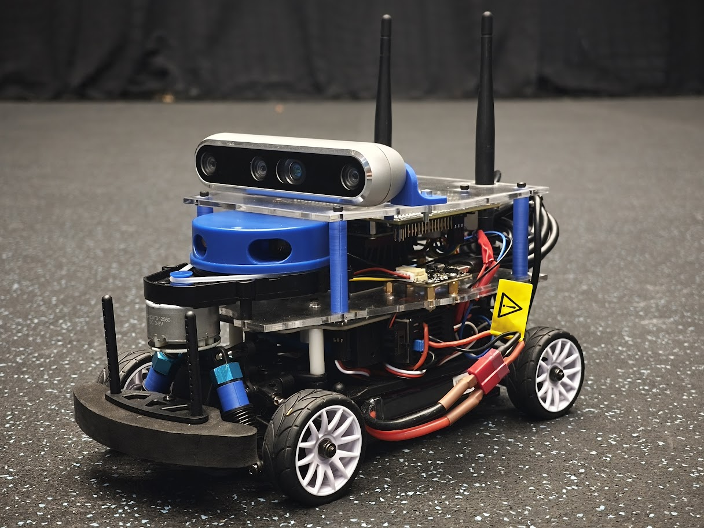

# Upgrading DART: Adding Traffic Light Detection and Control

<p align="center">
  
</p>

# This Repo
In this repository, we're upgrading the DART robot for traffic light detection. DART is a robot, created at the TU Delft, and instructions for building your own DART can be found [here](https://github.com/Lorenzo-Lyons/DART). In this repository, you'll find:
+ <b>Build instructions</b> for physical changes we made.
+ <b>Build instructions</b> for our 3D-printed traffic light.
+ <b>Software for Traffic Light Detection</b> in order that the DART recognises a traffic light and which light it's currently displaying.
+ <b>Control</b> a control algorithm that makes sure the DART stops for a red light, continues through a green light, and acts appropriately to a yellow light.

# Physical Changes We Made to DART
The physical changes we made to the DART:
+ We changed the baseboard and upperboard to lower the center of mass as much as possible, mount the electronics better, and be able to install the new camera setup and LiDar power supply.
+ We connected the LiDAR's power supply directly to the Jetson Nano Expansion Board rather than to the Jetson Nano itself. This setup resolves the issue of the LiDAR drawing too much current from the Jetson Nano.
+ We added a new camera setup to enable the DART to perform traffic light detection.
+ We 3D-printed spacers to stiffen the suspension. (Originally, brass spacers were installed.)

To see the full Build Instructions for these changes, and how to replicate our 3D-printed traffic light, go to [Build Instruction Section](https://github.com/Semthart28/DART-5/tree/main/Build%20Instructions).

# Software for Traffic Light Detection
For the traffic light detection, we trained the YOLOv3-tiny model on roughly 500 images of our 3D-printed traffic light. [YOLO](https://pjreddie.com/darknet/yolo/) 'You Only Look Once' is  an open-source, state-of-the-art real-time object detection system [1]. A short clip of the detection of a traffic light is shown below:

<p align="center">
  
</p>

We drew the bounding boxes around the traffic light with [LabelImg](https://github.com/HumanSignal/labelImg) to create the .txt files that tell the model which class it is (0, 1, or 2 for Red, Yellow, or Green, respectively) and the coordinates that define the bounding box around the traffic light. We then used an 80/20 training/testing split with the images.

Our configuration file is based on [Berktepebag's Github](https://github.com/berktepebag/Traffic-light-detection-with-YOLOv3-BOSCH-traffic-light-dataset) with these changed settings for the training:
+ We set the max iterations to 6000 
+ We set the batch to 64
+ We set the subdivision to 12
+ We set the steps to 4800, 5400

The DART can detect the traffic light colors from more than 1.5 meters away. Below are the instructions to add the traffic light detection to your DART.

### Step 0: Setting up the camera
To set up the camera on the Jetson Nano, run this command:
```
sudo apt-get install ros-$ROS_DISTRO-realsense2-camera
```

### Step 1: Installing Darknet
Darknet from the [original website](https://pjreddie.com/darknet/) is pretty outdated. However, so is the Jetson Nano, so it'll work fine. If you're on your laptop and trying yolo, we recommend installing Darknet via [AlexeyAB's Github](https://github.com/AlexeyAB/darknet), because you're going to run into compatibility issues. But on the Jetson Nano, you should install it from the original website like this:
```
git clone https://github.com/pjreddie/darknet.git
cd darknet
make
```
Now, make sure you've downloaded CUDA and OpenCV. The Jetson Nano already has CUDA pre-installed if you downloaded the Jetpack SDK. In the Makefile in the Darknet directory, edit the lines at the top like this:
```
GPU=1
OPENCV=1
```
Remake Darknet and you're done.

### Step 2: Download our Trained Model
In your Darknet directory, make a folder called 'Model' and add the three files from [this folder](https://github.com/Semthart28/DART-5/tree/main/YOLO-model). Then, make a folder called 'backup' within the 'Model' folder and add the 'yolov3-tiny-tf_best.weights' file in there.

### Step 3: Running the model
Make sure you're in the darknet directory and run this command to run the model:
```
./darknet detector demo Model/tf-data.data Model/yolov3-tiny-tf.cfg Model/backup/yolov3-tiny-tf_best.weights
```
A tab of your camera should now open, and the algorithm will detect traffic lights!

Additionally, you can play around with the threshold of when it will show the traffic light. Just add this at the end of the previous command:

```
-thresh 0.20
```

Now, it detects all traffic lights if the confidence is higher than 20%.

# Control Algorithm 
The first thing we need to do now is to turn our detection algorithm into a ROS package so the DART can act upon this information. This is done via the [darknet_ros Github](https://github.com/leggedrobotics/darknet_ros). Follow the melodic-and-noetic branch, but download the YoloObjectDetector.cpp file from this repository. We made the .cpp file compatible with the DART by using the fix/memory_leak branch. Originally, the RAM would fill up, and the system would freeze. Additionally, we made sure the color codes of Darknet ROS and the Intel camera match up. 

Next up, download the tf_controller_pkg folder from this repository, and put it in your catkin workspace. Remake your catkin workspace and run it with this command:

```
roslaunch tf_controller_pkg tf_controller.launch
```

The safety value is still on, so you have to run the gamepad basic file and hold R1 on the controller to remove the safety value. Comment out all the throttle commands in the gamepad_basic.py file from [Lorenzo's GitHub](https://github.com/Lorenzo-Lyons/DART), and put the throttle value in the racecar_universal.py file to 0.13. Run these in separate terminals:

```
rosrun racecar_pkg racecar_universal.py
```

```
rosrun racecar_pkg gamepad_basic.py
```

Now hold the R1 button on the controller to disable the safety value and the control works!

# References
https://github.com/Lorenzo-Lyons/DART

https://pjreddie.com/darknet/yolo/

https://github.com/berktepebag/Traffic-light-detection-with-YOLOv3-BOSCH-traffic-light-dataset

https://github.com/HumanSignal/labelImg

https://github.com/AlexeyAB/darknet

https://github.com/leggedrobotics/darknet_ros

